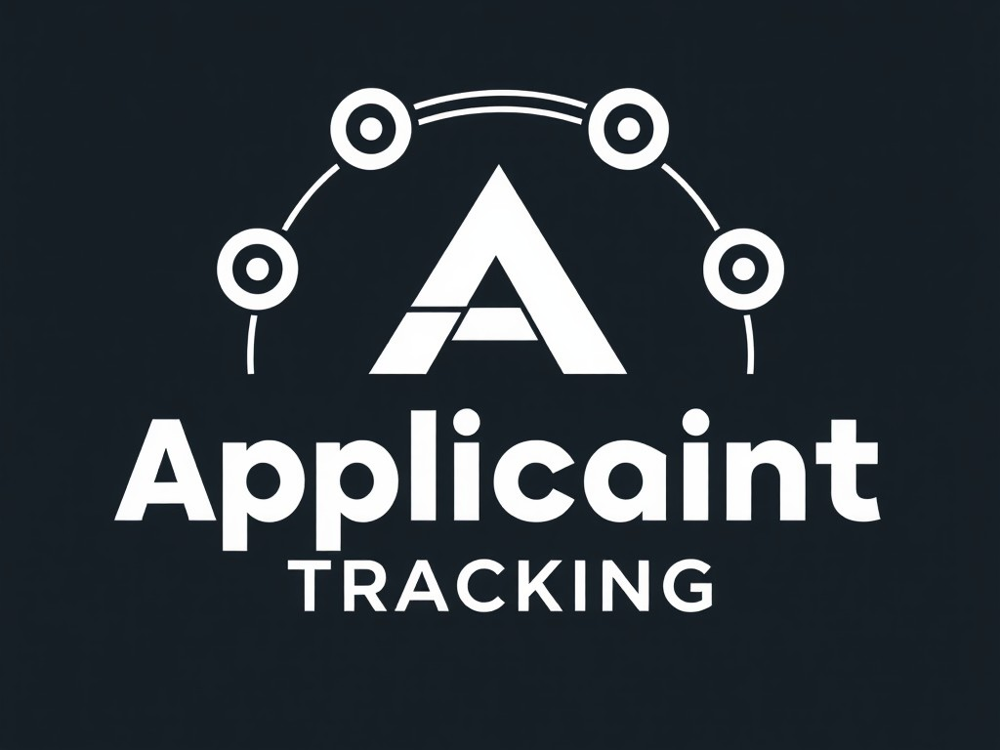

# Applicant Tracking System (ATS)

## Table of Contents

- [Introduction](#introduction)
- [Features](#features)
- [Algorithm Description](#algorithm-description)
- [Algorithm Summary](#algorithm-summary)
- [Demo](#demo)
- [Prerequisites](#prerequisites)
- [Installation](#installation)
- [Usage](#usage)
- [Project Structure](#project-structure)
- [Technical Details](#technical-details)
- [Troubleshooting](#troubleshooting)
- [Future Enhancements](#future-enhancements)
- [Contributing](#contributing)

---

## Introduction

The **Applicant Tracking System (ATS)** is a web application designed to streamline the recruitment process by automatically ranking candidate CVs based on their relevance to a given job description. By leveraging natural language processing (NLP) and machine learning techniques, the system identifies the top N CVs that best match the job requirements.

---

## Features

- **Upload Multiple CVs**: Support for uploading multiple CVs in PDF or TXT format.
- **Job Description Parsing**: Ability to upload a job description in PDF or TXT format.
- **Similarity Scoring**: Uses advanced NLP models to calculate the similarity between CVs and the job description.
- **Real-time Progress Updates**: Displays a progress bar to indicate the processing status.
- **Top N CVs Selection**: Allows users to specify the number of top CVs to retrieve.
- **Download CVs**: Provides download links for the top-ranked CVs.
- **Responsive UI**: User-friendly interface built with Bootstrap for responsive design.
- **Dark Mode**: Option to toggle between light and dark themes.
- **Security Measures**: Sanitizes file uploads to prevent malicious files from being processed.

---

## Algorithm Description

The algorithm used in this application scores the similarity between candidates' CVs (resumes) and the job description by comparing them. This process works through the following steps:

1. **File Upload**:
   - Users upload multiple CVs and a job description file. These files can be in PDF or TXT format.

2. **Text Extraction**:
   - **Extracting Text from CVs**: If a CV is a PDF file, text is extracted from each page using the `pdfplumber` library. If it's a TXT file, it is read directly.
   - **Extracting Text from Job Description**: The job description file is processed similarly to extract text.

3. **Preprocessing**:
   - **Converting to Lowercase**: All text is converted to lowercase to eliminate differences due to capitalization.
   - **Tokenization and Lemmatization**:
     - The text is tokenized using the English language model (`en_core_web_sm`) from `spaCy`.
     - Stopwords (like "the," "is," "at") and punctuation are removed.
     - The remaining words are converted to their base form (lemmas).

4. **Generating Vector Embeddings**:
   - Using the preprocessed text, sentence embeddings are generated with the `SentenceTransformer` model (`all-MiniLM-L6-v2`).
   - These embeddings are high-dimensional numerical vectors that capture the semantic meaning of the text.

5. **Calculating Similarity Scores**:
   - Cosine similarity (`cosine_similarity`) is calculated between the embedding of the job description and each CV's embedding.
   - Cosine similarity ranges from 0 to 1, where 1 indicates perfect similarity and 0 indicates no similarity.

6. **Ranking and Selection**:
   - All CVs are sorted in descending order based on their similarity scores.
   - The top N CVs, as specified by the user, are selected.

7. **Storing Results**:
   - The results of the selected CVs—including rank, filename, full filename (for download), and similarity score—are stored in a global dictionary (`global_results`) associated with the user's session ID (`sid`).

8. **Displaying Results**:
   - Upon completion of processing, the server emits a `processing_complete` event to the client associated with the session ID.
   - The client then redirects to the `/results/<sid>` path, where the stored results are displayed using a server-side template (`results.html`).
   - In the `results.html` template, Flask's `url_for` function is used to generate download links for each CV.

9. **Download Functionality**:
   - When the user clicks the "Download" button, a request is sent to the `/download/<folder>/<filename>` route.
   - The server uses `send_from_directory` to send the file from the appropriate folder.

10. **Real-Time Progress Updates**:
    - During processing, after each CV is processed, the server sends the progress percentage to the client via the `progress_update` event.
    - Client-side JavaScript uses this data to update the progress bar.

---

## Algorithm Summary

- **Use of NLP and Machine Learning**: The algorithm leverages natural language processing techniques and pre-trained models to convert textual data into numerical vectors that represent semantic meaning.
- **Similarity Measurement**: Cosine similarity is employed to quantify how closely each CV matches the job description.
- **Automation**: This automated process saves time on manual screening and enhances the efficiency of the recruitment workflow.

**Key Technologies and Libraries Used**:

- **Flask**: Serves as the web server and handles routing.
- **Flask-SocketIO**: Enables real-time communication between the server and client.
- **Eventlet**: Facilitates concurrent programming for handling multiple connections.
- **pdfplumber**: Extracts text content from PDF files.
- **spaCy**: Used for text preprocessing tasks like tokenization and lemmatization.
- **SentenceTransformers**: Generates vector embeddings from text using advanced language models.
- **scikit-learn**: Provides the `cosine_similarity` function for calculating similarity scores.

---

## Demo


---

## Prerequisites

Before you begin, ensure you have met the following requirements:

- **Python 3.6 or higher**: The application is written in Python and requires Python 3.6+.
- **Virtual Environment**: It's recommended to use a virtual environment to manage dependencies.
- **Internet Connection**: Required to download necessary NLP models and libraries.

---

## Installation

Follow these steps to set up the project on your local machine:

### 1. Clone the Repository

```bash
git clone https://github.com/muhammadasad149/Applicant-Tracking-System--ATS-.git
cd Applicant-Tracking-System--ATS-
```

### 2. Create a Virtual Environment

Create and activate a virtual environment to manage project dependencies.

#### On Windows:

```bash
python -m venv venv
venv\Scripts\activate
```

#### On macOS/Linux:

```bash
python3 -m venv venv
source venv/bin/activate
```

### 3. Install Dependencies

Install the required Python packages using `pip`:

```bash
pip install -r requirements.txt
```

### 4. Download NLP Models

Download the spaCy English language model:

```bash
python -m spacy download en_core_web_sm
```

### 5. .env File Setup

To generate a Flask secret key and set it in your `.env` file, follow these steps:

1. **Generate a Secret Key Using Python:**

   Open a Python shell or create a simple Python script, and execute the following commands:

   ```python
   import uuid
   secret_key = uuid.uuid4().hex
   print(secret_key)
   ```

   This code uses Python's `uuid` module to generate a random 32-character hexadecimal string, which is suitable for use as a secret key. For example, it might output:

   ```
   3d6f45a5fc12445dbac2f59c3b6c7cb1
   ```

2. **Set the Secret Key in the `.env` File:**

   Open your `.env` file and add the following line, replacing the placeholder with the secret key you just generated:

   ```
   FLASK_SECRET_KEY='3d6f45a5fc12445dbac2f59c3b6c7cb1'
   ```

   **Note:** Ensure there are no spaces around the `=` sign and that the key is enclosed in single quotes.

3. **Verify the Secret Key in Your Flask Application:**

   In your `app.py` or Flask application code, make sure you're loading the secret key from the environment variable:

   ```python
   import os
   from dotenv import load_dotenv

   load_dotenv()

   app = Flask(__name__)
   app.secret_key = os.environ.get('FLASK_SECRET_KEY')
   ```

   This ensures that your Flask app uses the secret key you've set in the `.env` file.

By following these steps, you have securely generated and set a Flask secret key in your `.env` file.

---

## Usage

### 1. Running the Application

Start the Flask application using the following command:

```bash
python app.py
```

The application will be accessible at `http://localhost:5000`.

### 2. Using the Application

- **Upload CVs and Job Description**: Navigate to the home page and use the form to upload multiple CVs and a job description.
- **Specify Top N CVs**: Enter the number of top CVs you wish to retrieve.
- **Submit the Form**: Click the "Submit" button to start the processing.
- **View Progress**: A progress bar and spinner will display the processing status.
- **View Results**: Once processing is complete, you will be redirected to a results page showing the top CVs.
- **Download CVs**: Click the "Download" button next to each CV to download it.

### 3. Dark Mode

Use the toggle switch in the navigation bar to switch between light and dark modes.

---

## Project Structure

```
Applicant-Tracking-System--ATS-/
│
├── app.py
├── requirements.txt
├── .env
├── templates/
│   ├── index.html
│   └── results.html
├── static/
│   ├── css/
│   │   └── styles.css
│   ├── js/
│   │   └── scripts.js
│   └── images/
│       └── logo.png
├── uploads/
│   ├── cvs/
│   └── job_description/
└── README.md
```

- **app.py**: Main Flask application file.
- **templates/**: Contains HTML templates for the application.
- **static/**: Contains static files like CSS, JavaScript, and images.
- **uploads/**: Stores uploaded CVs and job descriptions.
- **requirements.txt**: Lists all the Python dependencies.
- **.env**: Environment variables (e.g., secret keys).
- **README.md**: Project documentation.

---

## Technical Details

### 1. Backend

- **Flask**: A lightweight web framework for Python.
- **Flask-SocketIO**: Enables real-time communication between the client and server.
- **Eventlet**: Provides support for asynchronous networking.
- **NLP Libraries**:
  - **spaCy**: Used for text preprocessing, including tokenization and lemmatization.
  - **SentenceTransformers**: Provides pre-trained models for generating sentence embeddings.
- **Machine Learning**:
  - **scikit-learn**: Used for calculating cosine similarity between embeddings.
- **PDF Parsing**:
  - **pdfplumber**: Extracts text from PDF files.

### 2. Frontend

- **HTML/CSS**: Structure and styling of the web pages.
- **Bootstrap 5**: Provides responsive design and pre-built components.
- **JavaScript**:
  - **Socket.IO Client**: Handles real-time communication with the server.
  - **Fetch API**: Submits forms asynchronously to prevent page reloads.

---

## Troubleshooting

### 1. Common Issues

- **Model Download Errors**: Ensure you have a stable internet connection when downloading NLP models.
- **Port Already in Use**: If port 5000 is occupied, specify a different port when running the app:
  ```bash
  python app.py --port=5001
  ```
- **File Upload Limitations**: The default file upload size limit may need adjustment for large files.

### 2. Log Monitoring

- Check the terminal output where `app.py` is running for any error messages.
- Use Flask's debug mode to get detailed error information:
  ```python
  socketio.run(app, debug=True)
  ```

### 3. Dependency Issues

- If you encounter issues with package versions, ensure all packages are updated:
  ```bash
  pip install --upgrade -r requirements.txt
  ```

---

## Future Enhancements

- **Database Integration**: Store results and user sessions in a database.
- **User Authentication**: Implement user login and session management.
- **Email Notifications**: Send email alerts when processing is complete.
- **Advanced Matching Algorithms**: Incorporate more sophisticated AI models for better matching accuracy.
- **File Type Support**: Extend support to other file formats like DOCX.
- **Scalability**: Deploy the application using a WSGI server like Gunicorn for production environments.

---

## Contributing

Contributions are welcome! Please follow these steps:

1. **Fork the Repository**: Create a personal fork of the project.
2. **Create a Feature Branch**: Work on your feature or fix in a new branch.
3. **Commit Your Changes**: Write clear and concise commit messages.
4. **Push to Your Fork**: Push your changes to your forked repository.
5. **Submit a Pull Request**: Describe your changes and submit a PR for review.

---


